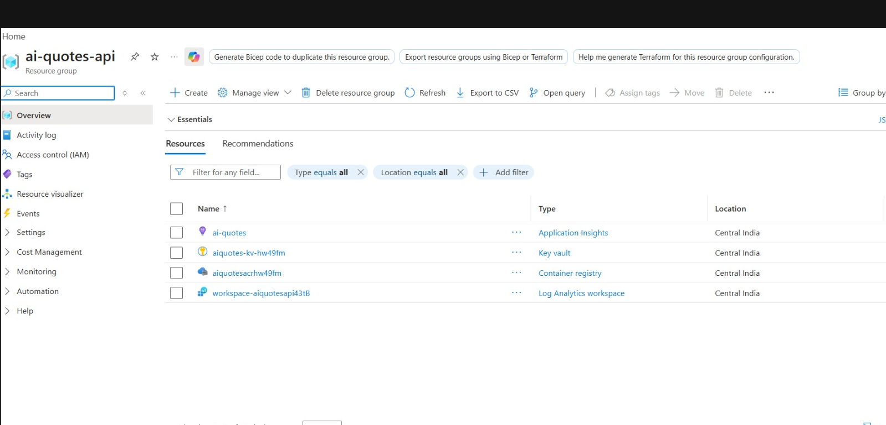
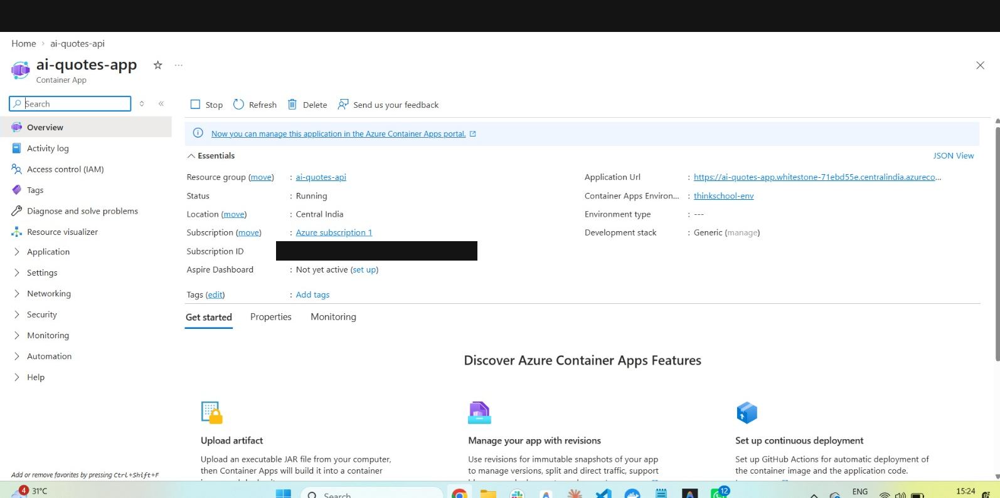
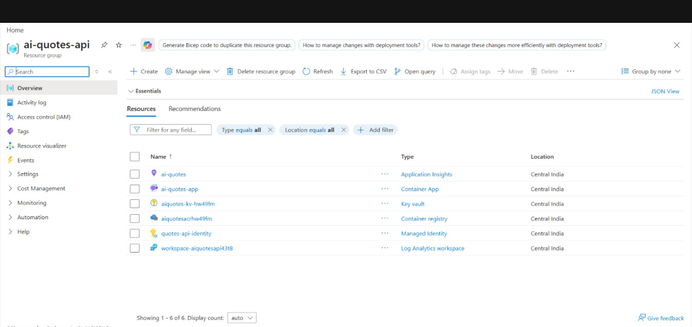
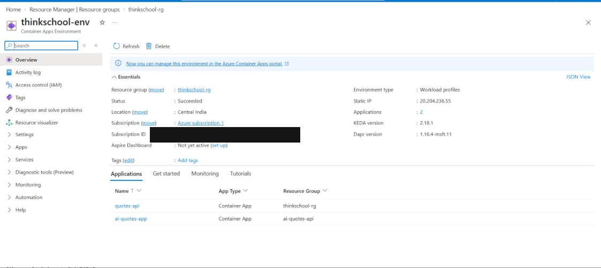

# QuotesApi on Azure Container Apps — ai-quotes-api deployment

A second, separate deployment of the same `QuotesApi` image, in the `ai-quotes-api` resource group, wired to the pre-existing `ai-quotes` Application Insights resource for telemetry.

## What was built

| Resource | Name | Resource Group | Notes |
|---|---|---|---|
| Container Registry | `aiquotesacrhw49fm.azurecr.io` | `ai-quotes-api` | Same image as the `thinkschool-rg` deployment, retagged and pushed here (no rebuild needed) |
| Key Vault | `aiquotes-kv-hw49fm` | `ai-quotes-api` | Holds a freshly generated `JwtSigningKey` and the real `AppInsightsConnectionString` pulled directly from the `ai-quotes` resource via CLI (never typed in chat or committed to any file) |
| Managed identity | `quotes-api-identity` | `ai-quotes-api` | Scoped RBAC: `AcrPull` on this ACR, `Key Vault Secrets User` on this vault |
| Container App | `ai-quotes-app` | `ai-quotes-api` | Reuses the existing `thinkschool-env` Container Apps environment (see below) — external ingress, port 8080, min 1 / max 5 replicas, HTTP-concurrency autoscaling |
| Application Insights | `ai-quotes` | `ai-quotes-api` | Pre-existing — not created by this deployment, only consumed |

**Live endpoint:** `https://ai-quotes-app.whitestone-71ebd55e.centralindia.azurecontainerapps.io/`

Verified across three separate requests, all `200 Quotes API is running!`. Container logs confirm a clean startup (Key Vault-sourced JWT key applied, no crash) and successful request handling.

## Screenshots

`ai-quotes-api` resource group before the container app and identity existed (only the pre-existing App Insights resource, the new ACR, and the new Key Vault):



The `ai-quotes-app` container app overview, showing `Running` status and `thinkschool-env` as its Container Apps environment:



`ai-quotes-api` resource group once everything was in place — ACR, Key Vault, managed identity, and the container app alongside the pre-existing App Insights resource:



`thinkschool-env`'s Applications tab, confirming it hosts both container apps across the two resource groups — `quotes-api` (`thinkschool-rg`) and `ai-quotes-app` (`ai-quotes-api`):



Note: these portal screenshots show the account's subscription ID and email in the top corner (Azure portal chrome) — not redacted, since these are images rather than text and weren't edited before being added here.

## Why this shares thinkschool-env instead of its own environment

The subscription enforces a limit of **one Container Apps environment per region** (`MaxNumberOfRegionalEnvironmentsInSubExceeded`). Central India already had `thinkschool-env` from Day 5 Task 3, so creating a second environment there wasn't possible. Rather than switching regions (which would separate the app from the `ai-quotes` App Insights resource, also in Central India), this deployment reuses `thinkschool-env` — a container app can reference an environment in a different resource group via its full resource ID, so `ai-quotes-app` lives in `ai-quotes-api` while its environment lives in `thinkschool-rg`.

Practical consequence: `ai-quotes-app` and `quotes-api` (the Task 3 app) share the same environment-level infrastructure (networking, the underlying Log Analytics workspace) but have fully separate ACR, Key Vault, managed identity, and secrets. Container app names must be unique per environment, which is why this app is `ai-quotes-app` rather than reusing `quotes-api`.

## Cleanup

Deleting `ai-quotes-api` removes the ACR, Key Vault, managed identity, and this container app — but **not** `thinkschool-env`, since that environment lives in `thinkschool-rg` and is still in use by the other app:

```
az group delete -n ai-quotes-api --yes --no-wait
```

As with the other Key Vault, soft-delete (90-day retention) means the vault name isn't freed immediately — purge it separately if you want to reuse `aiquotes-kv-hw49fm`:
```
az keyvault purge --name aiquotes-kv-hw49fm --location centralindia
```

Deleting `thinkschool-rg` (per the Task 3 cleanup note) would also delete `thinkschool-env` — since `ai-quotes-app` depends on it, that would take this app down too. Delete `ai-quotes-api` first if you want to retire it independently.
