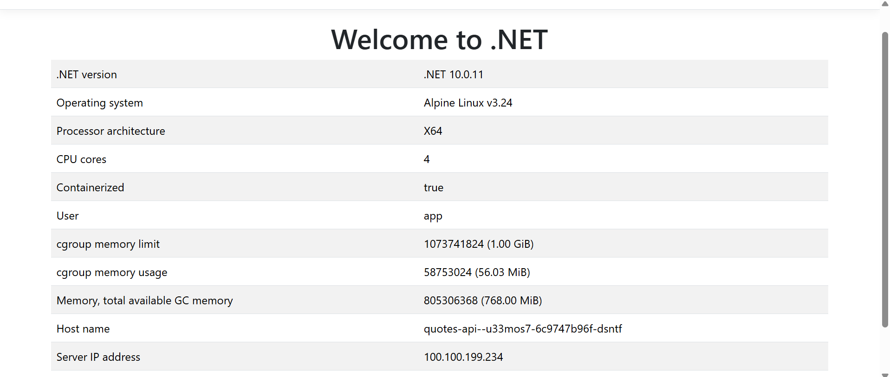

# QuotesApi on Azure Container Apps

## What was built

On top of the `thinkschool-rg` resource group and `thinkschool-env` environment from Day 5 Task 3, this deployment adds:

| Resource | Name | Purpose |
|---|---|---|
| Container Registry | `thinkschoolacrrhbyj4.azurecr.io` | Hosts the `quotes-api:0.1.0` image (admin login disabled — identity-based auth only) |
| Key Vault | `thinkschool-kv-rhbyj4` | Holds `JwtSigningKey` and `AppInsightsConnectionString` secrets (RBAC-authorized, no access policies) |
| Managed identity | `quotes-api-identity` | User-assigned identity the container app uses to pull from ACR and read Key Vault secrets — no credentials stored anywhere |
| Container App | `quotes-api` | The running app: external ingress, target port 8080, min 1 / max 5 replicas, HTTP-concurrency autoscaling (50 concurrent requests/replica) |

A `Dockerfile` and `.dockerignore` were added to `Day-5/QuotesApi/` (none existed before) — multi-stage build on `mcr.microsoft.com/dotnet/sdk:10.0` / `mcr.microsoft.com/dotnet/aspnet:10.0`, listening on port 8080 via `ASPNETCORE_HTTP_PORTS`.

**Live endpoint:** `https://quotes-api.whitestone-71ebd55e.centralindia.azurecontainerapps.io/`

Verified with a fresh request:
```
$ curl -v https://quotes-api.whitestone-71ebd55e.centralindia.azurecontainerapps.io/
< HTTP/1.1 200 OK
< content-type: text/plain; charset=utf-8
< server: Kestrel
Quotes API is running!
```

Container logs confirm a clean startup with the Key Vault-sourced signing key applied — no crash, no fallback to a default key:
```
[09:31:40 INF] Microsoft.Hosting.Lifetime: Now listening on: http://[::]:8080
[09:31:40 INF] Microsoft.Hosting.Lifetime: Application started. Press Ctrl+C to shut down.
[09:31:40 INF] Microsoft.Hosting.Lifetime: Hosting environment: Production
```

## Fixes made to the originally proposed script

The script that kicked off this deployment had two real bugs and one security issue, caught before anything ran:

1. **Wrong environment variable name.** It set `Jwt__Secret`, but `QuotesApi.Extensions.InfrastructureExtensions.AddInfrastructure` binds the signing key from configuration section `Jwt` → property `SigningKey`, i.e. the env var must be `Jwt__SigningKey`. The original var would have been silently ignored and the app would have crashed on startup (`ArgumentNullException` in `Encoding.UTF8.GetBytes`).
2. **Hardcoded JWT secret.** The script had a literal signing key baked in as a parameter default, passed via a plain CLI arg — visible in shell history/process listings and would have ended up committed if the script were saved as-is. Replaced with a Key Vault reference (`keyvaultref:...,identityref:...`) resolved by the container app's managed identity at runtime; the actual value is never written to any file or script.
3. **No registry qualification.** `--image quotes-api:0.1.0` had no registry host, so `containerapp create` would have tried Docker Hub, where the image doesn't exist. Fixed to `<acr-login-server>/quotes-api:0.1.0`.

Also: the original script printed `/health`, `/health/live`, `/health/ready` URLs, but `QuotesApi` doesn't implement any health endpoints — those lines were dropped from the corrected script rather than left in as unverified/misleading claims.

## Real obstacles hit during setup

- **`az acr build` (remote build) is blocked on this subscription** — `TasksOperationsNotAllowed`, a restriction on this subscription tier that needs an Azure support request to lift. Fell back to local `docker build` + `docker push`, which required starting Docker Desktop (it wasn't running).
- **Key Vault RBAC mode doesn't grant the creator data-plane rights.** Creating the vault didn't automatically let the signed-in account write secrets into it — a separate `Key Vault Secrets Officer` role assignment (scoped to the vault, on the human account) was needed before `az keyvault secret set` would work. The equivalent grant for the app's own managed identity (`Key Vault Secrets User` + `AcrPull`, both scoped narrowly to the vault/registry) was done first without issue.
- **A one-time cold-start artifact.** The very first request to the app's FQDN returned a generic ".NET sample app" placeholder page before the container was fully warmed up; a second request moments later returned the correct `Quotes API is running!` response. Container logs confirmed the real app was healthy throughout — this was an ingress-level transient, not an app bug.

## A stale-cache scare

Well after this deployment was verified working, a browser screenshot of `quotes-api`'s FQDN showed the generic ".NET sample app" placeholder page again — the same kind of content seen during the very first cold-start request:



This was re-investigated rather than taken at face value. At the time of the screenshot, `az containerapp revision list` / `replica list` showed exactly **one** running replica (`quotes-api--0000001-7674fc77c9-bxgdf`), and every fresh `curl` against the same URL — before, during, and after the screenshot — returned the correct `Quotes API is running!` response, with request logs on the server confirming each of those hits. The replica hostname baked into the screenshot's HTML didn't match any replica that was actually running at the time, which points to the browser tab serving a **cached copy** of the very first (cold-start) response rather than a live request. A hard refresh clears this; curl, which never caches, was unaffected throughout.

## Cleanup

Everything above lives inside `thinkschool-rg`, so the same cleanup command from Task 3 tears all of it down together:

```
az group delete -n thinkschool-rg --yes --no-wait
```

One thing to know: the Key Vault has soft-delete enabled (90-day retention, cannot be disabled) and is **not** purged by resource group deletion — the vault name (`thinkschool-kv-rhbyj4`) stays reserved and needs an explicit purge if you want to reuse it:
```
az keyvault purge --name thinkschool-kv-rhbyj4 --location centralindia
```
