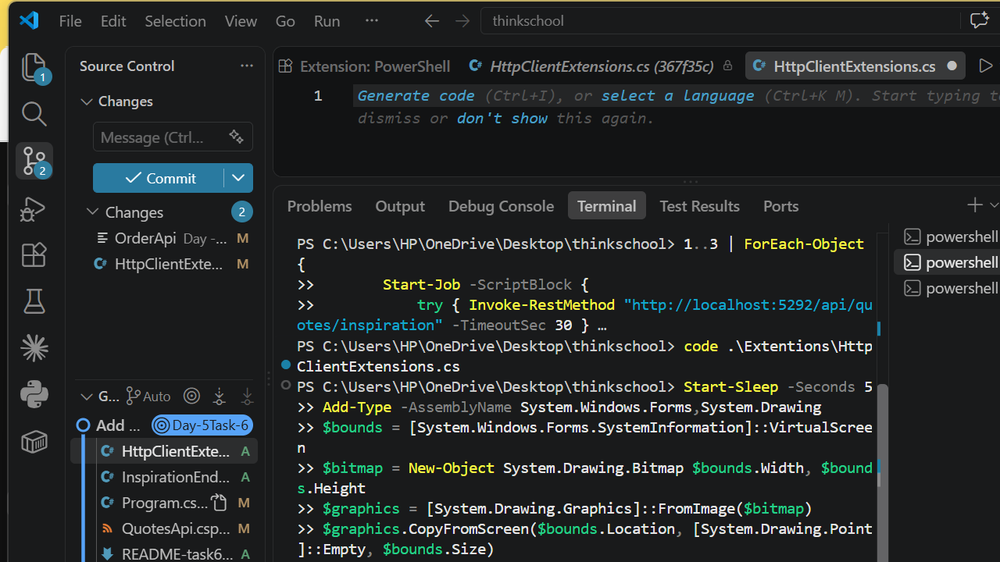
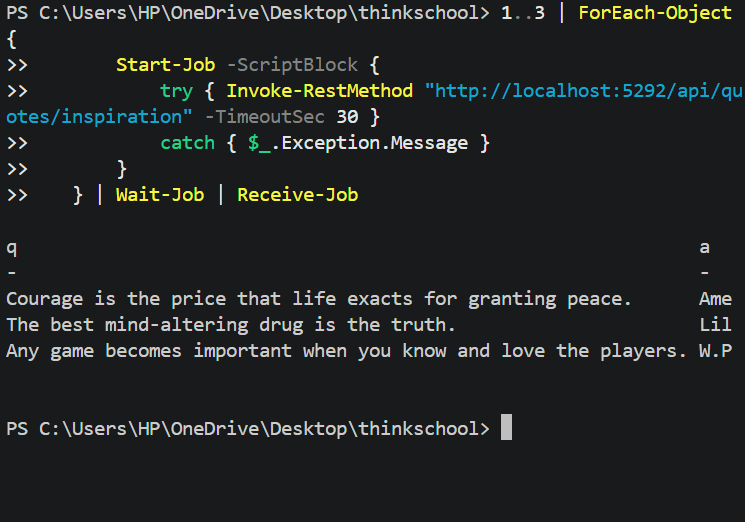

# Day 5 — Task 6: Polly-Based Resilience for Outbound HTTP Calls

## Investigation — does QuotesApi make any outbound HTTP calls?

Honest answer: **no, not in practice.** Searched the codebase for `HttpClient`, `IHttpClientFactory`, `AddHttpClient`, and `Microsoft.Identity.Web` — none of these are used anywhere. Two code paths exist that *could* make an outbound call, but both are dormant given how this app is actually configured and used:

- [`Extentions/InfrastructureExtensions.cs`](QuotesApi/Extentions/InfrastructureExtensions.cs) registers an `AddJwtBearer("EntraJwt", ...)` scheme with `options.Authority = https://login.microsoftonline.com/{tenantId}/v2.0`. When that scheme actually validates a token, ASP.NET Core's `JwtBearerHandler` fetches OIDC discovery + JWKS from Entra over HTTPS via an internal backchannel. But the policy scheme only forwards to `EntraJwt` when an inbound token's issuer contains `login.microsoftonline.com` — and every login flow in this app (`POST /api/auth/login`) issues an internally-signed HMAC token via the `InternalJwt` scheme instead. No caller has ever presented a real Entra-issued token to this API, so this path has never fired.
- The same file conditionally calls `AddAzureKeyVault` + `DefaultAzureCredential`, gated behind a `KeyVault:Uri` config value. That key is unset in `appsettings.json`, `appsettings.Development.json`, and the live Container App's environment variables (Day 5 Task 4 used Container App secrets, not Key Vault) — so this path is also unreachable today.

This confirms the suspicion going in: QuotesApi's JWTs are self-issued with a local HMAC key, not validated against Entra over HTTP, and there is no other outbound dependency anywhere in the request-serving code.

## What was added, and why

Since there was nothing real to wrap, one minimal, honestly-labeled example was added instead of pretending an existing call was there:

- **`GET /api/quotes/inspiration`** ([`Extentions/InspirationEndpointExtensions.cs`](QuotesApi/Extentions/InspirationEndpointExtensions.cs)) — calls [zenquotes.io](https://zenquotes.io/api/random), a real public quotes API, and returns a random quote. Both this file and the resilience registration are commented in code as "added to demonstrate the resilience pattern... not part of the app's prior functionality" — this is not presented as pre-existing behavior.
- Auth: **explicitly `AllowAnonymous()`**. This is a read-only proxy to a public external API — it touches no app data and needs no caller identity, matching the existing pattern where `GET /api/quotes` and `GET /api/quotes/{id}` are also public (only the write endpoints — `POST`/`PUT`/`DELETE` — call `RequireAuthorization()`).
- **`Microsoft.Extensions.Http.Resilience` 10.9.0** added to `QuotesApi.csproj` (resolved for this repo's `net10.0` target; pulls in `Polly.Core` 8.4.2 transitively).

## Resilience configuration

[`Extentions/HttpClientExtensions.cs`](QuotesApi/Extentions/HttpClientExtensions.cs):

```csharp
using Microsoft.Extensions.Http.Resilience;
using Polly;

namespace QuotesApi.Extensions;

public static class HttpClientExtensions
{
    private const int MaxRetryAttempts = 3;

    public static IServiceCollection AddExternalQuotesClient(this IServiceCollection services)
    {
        services.AddHttpClient("external-quotes", client =>
        {
            client.BaseAddress = new Uri("https://zenquotes.io/");
        })
        .AddResilienceHandler("default", (pipeline, context) =>
        {
            var logger = context.ServiceProvider
                .GetRequiredService<ILoggerFactory>()
                .CreateLogger("ExternalQuotes.Resilience");

            pipeline
                .AddRetry(new HttpRetryStrategyOptions
                {
                    MaxRetryAttempts = MaxRetryAttempts,
                    BackoffType = DelayBackoffType.Exponential,
                    UseJitter = true,
                    OnRetry = args =>
                    {
                        var host = args.Context.GetRequestMessage()?.RequestUri?.Host ?? "unknown-host";

                        logger.LogWarning(
                            args.Outcome.Exception,
                            "Retry {AttemptNumber}/{MaxAttempts} calling {Host} after {DelayMs:F0}ms backoff — last result: {StatusCode}",
                            args.AttemptNumber + 1,
                            MaxRetryAttempts,
                            host,
                            args.RetryDelay.TotalMilliseconds,
                            args.Outcome.Result?.StatusCode.ToString() ?? "no response (exception)");

                        return ValueTask.CompletedTask;
                    }
                })
                .AddCircuitBreaker(new HttpCircuitBreakerStrategyOptions
                {
                    FailureRatio = 0.5,
                    SamplingDuration = TimeSpan.FromSeconds(30),
                    MinimumThroughput = 10,
                    BreakDuration = TimeSpan.FromSeconds(30),
                    OnOpened = args =>
                    {
                        var host = args.Context.GetRequestMessage()?.RequestUri?.Host ?? "unknown-host";

                        logger.LogError(
                            "Circuit breaker OPEN for {Host} for {BreakDurationSeconds}s — failure ratio exceeded 50% over the last 30s window. Last outcome: {StatusCode} {Exception}",
                            host,
                            args.BreakDuration.TotalSeconds,
                            args.Outcome.Result?.StatusCode.ToString() ?? "no response (exception)",
                            args.Outcome.Exception?.Message ?? "n/a");

                        return ValueTask.CompletedTask;
                    },
                    OnClosed = args =>
                    {
                        logger.LogInformation("Circuit breaker CLOSED — target host has recovered");
                        return ValueTask.CompletedTask;
                    }
                })
                .AddTimeout(TimeSpan.FromSeconds(10));
        });

        return services;
    }
}
```

Pipeline order is Retry (outermost) → Circuit Breaker → Timeout (innermost) — Microsoft's own recommended ordering for the "standard" HTTP resilience pipeline.

**`MinimumThroughput = 10`**: Polly's own default is 100, which assumes a much higher-traffic service than this single outbound dependency sees. 10 is high enough that 1-2 isolated blips on a quiet client don't trip the breaker, but low enough that a real outage — a handful of real requests during normal light traffic — still does.

**`BreakDuration = 30s`**: matches the sampling window. Gives the downstream dependency a full window to recover before the breaker lets a probe request back through, rather than hammering it again seconds later.

## Proof: failure run

The client's `BaseAddress` was temporarily pointed at an unreachable local port (`http://127.0.0.1:59999/`) to force real connection failures. Three concurrent requests to `/api/quotes/inspiration` produced:

```
[21:12:38 WRN] ExternalQuotes.Resilience: Retry 1/3 calling 127.0.0.1 after 1966ms backoff — last result: no response (exception)
[21:12:38 WRN] ExternalQuotes.Resilience: Retry 1/3 calling 127.0.0.1 after 1429ms backoff — last result: no response (exception)
[21:12:38 WRN] ExternalQuotes.Resilience: Retry 1/3 calling 127.0.0.1 after 1395ms backoff — last result: no response (exception)
[21:12:42 WRN] ExternalQuotes.Resilience: Retry 2/3 calling 127.0.0.1 after 1484ms backoff — last result: no response (exception)
[21:12:42 WRN] ExternalQuotes.Resilience: Retry 2/3 calling 127.0.0.1 after 2056ms backoff — last result: no response (exception)
[21:12:42 WRN] ExternalQuotes.Resilience: Retry 2/3 calling 127.0.0.1 after 1243ms backoff — last result: no response (exception)
[21:12:45 WRN] ExternalQuotes.Resilience: Retry 3/3 calling 127.0.0.1 after 3127ms backoff — last result: no response (exception)
[21:12:45 WRN] ExternalQuotes.Resilience: Retry 3/3 calling 127.0.0.1 after 4493ms backoff — last result: no response (exception)
[21:12:46 WRN] ExternalQuotes.Resilience: Retry 3/3 calling 127.0.0.1 after 7647ms backoff — last result: no response (exception)
[21:12:50 ERR] ExternalQuotes.Resilience: Circuit breaker OPEN for 127.0.0.1 for 30s — failure ratio exceeded 50% over the last 30s window. Last outcome: no response (exception) No connection could be made because the target machine actively refused it. (127.0.0.1:59999)
```

Real, growing (with jitter) exponential backoff delays are visible in the timestamps: retries at `:38`, `:42`, `:45/46` — roughly 2s, 4s apart, matching `Delay=2s` with `Exponential` backoff. The third concurrent request received back `"The circuit is now open and is not allowing calls."` directly. Every failed request surfaced a clean `503 Service Unavailable` to the caller:

```json
{"type":"https://tools.ietf.org/html/rfc9110#section-15.6.4","title":"External quotes service is unavailable","status":503,"detail":"No connection could be made because the target machine actively refused it. (127.0.0.1:59999)"}
```

Nothing failed silently or hung indefinitely — the worst case (full retry exhaustion) took ~17s and returned a clear error.

**Real terminal capture** of a later run of this same scenario — 3 concurrent requests, each retrying 3 times, then the circuit breaker opening:



## Proof: success run

`BaseAddress` was reverted to the real `https://zenquotes.io/` endpoint:

```
$ curl http://localhost:5300/api/quotes/inspiration
[{"q":"The person who never made a mistake never tried anything new.","a":"Albert Einstein", ...}]
HTTP 200, 1.31s
```

No `ExternalQuotes.Resilience` log lines fired at all — a healthy dependency produces zero retry noise.

**Real terminal capture** — 3 concurrent requests against the real endpoint, all returning real quotes with no retries:



## What this session taught

`OnRetry`/`OnOpened` arguments don't carry a `HttpResponseMessage` on a connection-level exception (there's no response to attach a `RequestMessage` to) — the first draft of this logging pulled the host from `args.Outcome.Result?.RequestMessage?.RequestUri?.Host`, which is always `null` on a connection refusal and printed `"unknown-host"`. The fix is `args.Context.GetRequestMessage()?.RequestUri?.Host` — `Polly.HttpResilienceContextExtensions.GetRequestMessage` pulls the request straight off the `ResilienceContext`, which is populated regardless of whether the attempt got as far as a response. The circuit breaker counts every individual retry *attempt* as one throughput sample (since Retry wraps Circuit Breaker in the pipeline) — so a burst of just 2-3 concurrent requests, each retrying 3 times, was enough to exceed `MinimumThroughput = 10` and trip the breaker within a few seconds, without needing dozens of separate calls.

## What would break this

- **`MinimumThroughput` set too low** (e.g. 2-3) would trip the breaker on ordinary transient blips in a low-traffic dependency, taking a healthy service offline from the caller's perspective for no real reason.
- **The 10s total timeout being too short** for a dependency that's merely slow-but-healthy (e.g. a cold-starting serverless backend) — a legitimately-successful-but-slow response gets treated as a failure and burns retry budget instead of just waiting.
- **`BreakDuration` too short relative to the real outage** causes the breaker to flap open → half-open → open repeatedly instead of giving the dependency a real recovery window.
- **Retry's default `ShouldHandle` treats all 5xx as transient** — if an external API misuses 5xx for a genuine client-side error, retrying just delays an inevitable failure instead of surfacing it immediately.
