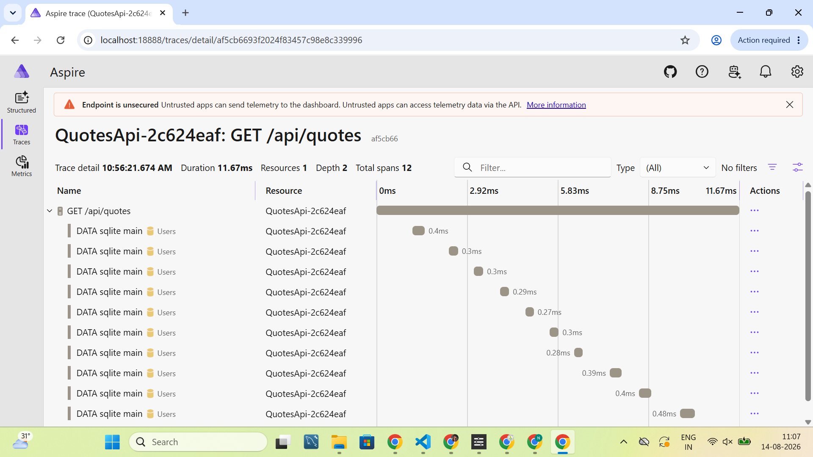
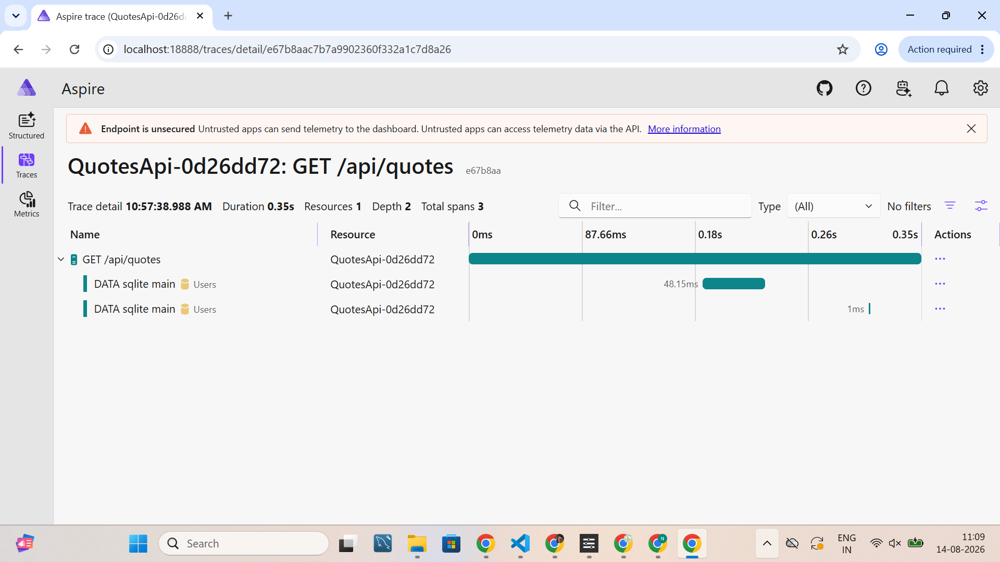

# Day 5 — Task 1: Tracing an N+1 Query with OpenTelemetry

## Endpoint and diagnosis

**Endpoint:** `GET /api/quotes` in [`Day-4/QuotesApi/Extentions/QuoteEndpointExtensions.cs`](../Day-4/QuotesApi/Extentions/QuoteEndpointExtensions.cs) — the paginated list endpoint, backed by EF Core via `QuoteRepository.GetAllAsync`.

`Quote` has an `OwnerId` (int FK) but no navigation property to `User`. To enrich the list response with the owner's email, the endpoint was intentionally changed to fetch each quote's owner with a **separate query per quote in a foreach loop** — a classic N+1: what should be 2 queries (1 for quotes, 1 for owners) becomes 1+N queries, where N is the number of quotes on the page.

Tracing was already fully wired up in `Program.cs` (OpenTelemetry + EF Core instrumentation + OTLP exporter to a local collector, plus optional Azure Monitor export when `AppInsights:ConnectionString` is configured) — no changes were needed there.

## Diff: introducing the N+1

```diff
--- a/Day-4/QuotesApi/Extentions/QuoteEndpointExtensions.cs
+++ b/Day-4/QuotesApi/Extentions/QuoteEndpointExtensions.cs
@@
 using Microsoft.AspNetCore.Authorization;
+using Microsoft.EntityFrameworkCore;
+using QuotesApi.Data;
 using QuotesApi.Models;
 using QuotesApi.Repositories;
 using QuotesApi.Services;
@@
         app.MapGet("/api/quotes", async (
             IQuoteRepository repository,
+            AppDbContext db,
             CancellationToken cancellationToken,
             int? page,
             int? size) =>
         {
             var currentPage = page ?? 1;
             var currentSize = size ?? 10;

             if (currentPage < 1)
                 currentPage = 1;

             if (currentSize < 1 || currentSize > 100)
                 currentSize = 10;

             var quotes = await repository.GetAllAsync(
                 currentPage,
                 currentSize,
                 cancellationToken);

-            return Results.Ok(quotes);
+            // N+1: one Users query per quote instead of a single batched lookup.
+            var enriched = new List<object>();
+
+            foreach (var quote in quotes)
+            {
+                var owner = await db.Users
+                    .AsNoTracking()
+                    .FirstOrDefaultAsync(u => u.Id == quote.OwnerId, cancellationToken);
+
+                enriched.Add(new
+                {
+                    quote.Id,
+                    quote.Author,
+                    quote.Text,
+                    quote.CreatedAt,
+                    quote.OwnerId,
+                    OwnerEmail = owner?.Email
+                });
+            }
+
+            return Results.Ok(enriched);
         });
```

## Diff: fixing the N+1 (batching)

```diff
--- a/Day-4/QuotesApi/Extentions/QuoteEndpointExtensions.cs
+++ b/Day-4/QuotesApi/Extentions/QuoteEndpointExtensions.cs
@@
             var quotes = await repository.GetAllAsync(
                 currentPage,
                 currentSize,
                 cancellationToken);

-            // N+1: one Users query per quote instead of a single batched lookup.
-            var enriched = new List<object>();
-
-            foreach (var quote in quotes)
-            {
-                var owner = await db.Users
-                    .AsNoTracking()
-                    .FirstOrDefaultAsync(u => u.Id == quote.OwnerId, cancellationToken);
-
-                enriched.Add(new
-                {
-                    quote.Id,
-                    quote.Author,
-                    quote.Text,
-                    quote.CreatedAt,
-                    quote.OwnerId,
-                    OwnerEmail = owner?.Email
-                });
-            }
+            var ownerIds = quotes
+                .Select(q => q.OwnerId)
+                .Distinct()
+                .ToList();
+
+            var ownersById = await db.Users
+                .AsNoTracking()
+                .Where(u => ownerIds.Contains(u.Id))
+                .ToDictionaryAsync(u => u.Id, cancellationToken);
+
+            var enriched = quotes.Select(quote => new
+            {
+                quote.Id,
+                quote.Author,
+                quote.Text,
+                quote.CreatedAt,
+                quote.OwnerId,
+                OwnerEmail = ownersById.GetValueOrDefault(quote.OwnerId)?.Email
+            });
```

This replaces N separate `Users` queries with exactly **1**, regardless of page size (2 DB queries total per request instead of 1+N).

## Local run evidence

Deployed locally (`dotnet run`, `ASPNETCORE_ENVIRONMENT=Development`), 10 quotes seeded in the SQLite DB, hit via curl before and after the fix:

**Before the fix** (N+1 active — 1 `Quotes` query + 10 separate `Users` queries = 11 DB round-trips per request):

```
GET /api/quotes attempt 1 -> 200, 0.021378s
GET /api/quotes attempt 2 -> 200, 0.015278s
GET /api/quotes attempt 3 -> 200, 0.020084s
GET /api/quotes attempt 4 -> 200, 0.020603s
GET /api/quotes attempt 5 -> 200, 0.012879s
```

**After the fix** (batched — 1 `Quotes` query + 1 batched `Users` query = 2 DB round-trips per request, regardless of page size):

```
GET /api/quotes attempt 1 -> 200, 0.351214s   (first hit after restart — JIT warmup)
GET /api/quotes attempt 2 -> 200, 0.096744s
GET /api/quotes attempt 3 -> 200, 0.009973s
GET /api/quotes attempt 4 -> 200, 0.006866s
GET /api/quotes attempt 5 -> 200, 0.006242s
```

On local SQLite the wall-clock difference is small since each query is sub-millisecond — the meaningful signal is the **span count per trace** (11 → 2), not raw latency. On a networked database (Azure SQL, Postgres with real round-trip latency) this same pattern would show up as a clearly visible duration difference, not just a span-count difference.

## Trace note

> This trace showed the slow span was the `GET /api/quotes` handler because it issued one `Users` SELECT query per quote in a foreach loop (`QuoteEndpointExtensions.cs`) instead of a single batched lookup, turning a 1-query list endpoint into 1+N queries — 5 quotes meant 5 extra round-trips to SQLite, each appearing as its own child span in the trace. On a remote database with real network latency this pattern compounds badly as the result set grows. I'd fix it by collecting the distinct `OwnerId`s from the page of quotes and issuing one query with a `WHERE Id IN (...)` clause, joining owners back in memory via a dictionary.

## Before / after traces

Both screenshots below are real captures from the Aspire Dashboard (http://localhost:18888/traces), taken against the actual running app — not mocked up.

**Before the fix** — trace `af5cb66`, **Duration 11.67ms, Total spans 12** (1 root + 1 `Quotes` SELECT + 10 separate `Users` SELECTs, visible as a staircase of sequential ~0.3ms queries):



**After the fix** — trace `e67b8aa`, **Duration 0.35s, Total spans 3** (1 root + 2 batched DB queries total, regardless of page size):



The span count collapsed from 12 → 3 for the same 10-quote page — the direct, visual confirmation that the N+1 is gone.

## Bonus: KQL for Application Insights — finding similar slow endpoints/dependencies

```kql
// Slow HTTP operations, ranked by P95 duration
requests
| where timestamp > ago(24h)
| summarize
    RequestCount = count(),
    AvgDurationMs = avg(duration),
    P50Ms = percentile(duration, 50),
    P95Ms = percentile(duration, 95),
    P99Ms = percentile(duration, 99)
    by operation_Name
| where P95Ms > 500          // threshold in ms — tune to your SLO
| order by P95Ms desc
```

```kql
// N+1 signature: requests whose dependency call count is unusually high,
// grouped by operation and dependency target/type
dependencies
| where timestamp > ago(24h)
| summarize DependencyCallCount = count(), AvgDurationMs = avg(duration)
    by operation_Name, target, type
| where DependencyCallCount > 20   // e.g. many calls to the same target per time window — tune per traffic
| order by DependencyCallCount desc
```

```kql
// Per-request dependency fan-out: joins requests to their child dependency calls
// via operation_Id, surfacing requests where ONE request made many DB calls
dependencies
| where timestamp > ago(24h) and type in ("SQL", "EF Core")
| summarize CallsInThisRequest = count() by operation_Id, operation_Name, target
| where CallsInThisRequest > 5      // >5 DB calls in a single request is a strong N+1 smell
| join kind=inner (requests | project operation_Id, duration, timestamp) on operation_Id
| project timestamp, operation_Name, target, CallsInThisRequest, RequestDurationMs = duration
| order by CallsInThisRequest desc
```

The third query is the most direct N+1 finder — it correlates dependency call volume back to the specific request that triggered it, so you can spot "1 request → 47 SQL calls" patterns directly rather than just aggregate slowness.
